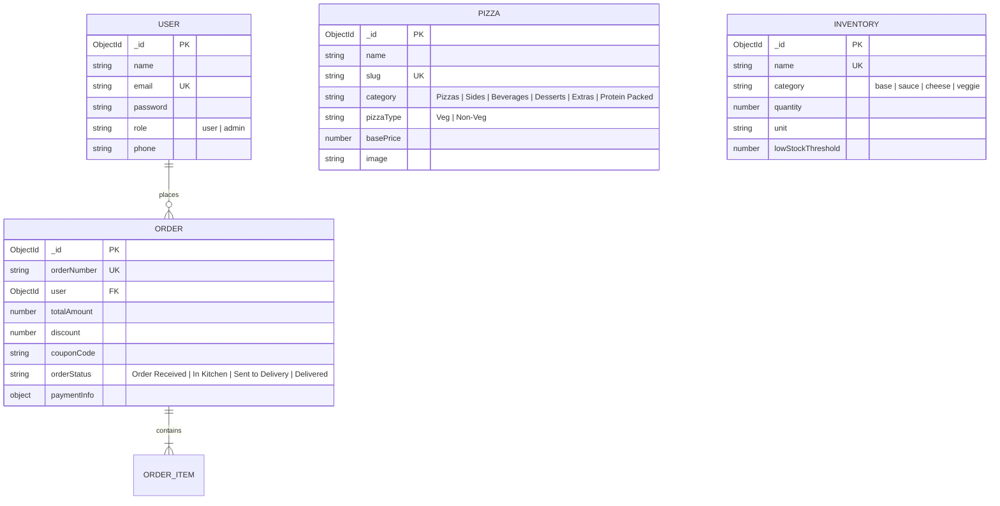

# 🍕 PizzaNest — Full-Stack Pizza Delivery & Kitchen Management Platform

[](https://oasisinfobyte.com/)
[](https://react.dev/)
[](https://nodejs.org/)
[](https://mongodb.com/)
[](https://socket.io/)
[](https://razorpay.com/)

---

## 📌 Project Overview
**PizzaNest** is a full-stack pizza ordering, live kitchen dispatch, real-time tracking, and automated inventory management web application developed as part of the **OASIS INFOBYTE Web Development & Designing Internship (Level 3 — Task 1)**.

The project features a **Customer Ordering Portal** paired with a **Master Administrator Dashboard**, connected in real time via **WebSockets (Socket.IO)** and protected with **JWT Authentication** and **Role-Based Access Control (RBAC)**.

---

## 🌟 Key Features

### 👤 Customer Experience
- **Interactive Menu Catalog**: Categorized into *Protein Packed, Gourmet Pizzas, Sides & Breads, Beverages, Desserts, and Extras & Dips*.
- **Size & Crust Customization**: Real-time price calculation based on chosen size (*Regular, Medium, Large*) and crust type (*Original, Thin, Cheese Burst, Whole Wheat, Gluten Free*).
- **Coupon & Deals Engine**: Real-time discount validation with promo codes (`BOGO2026`, `CUSTOM30`, `FEAST499`, `FREEBREAD`).
- **Interactive Cart & Steppers**: Real-time quantity steppers (`+` / `-`), instant item removal, GST (5%) calculation, and dynamic free delivery above ₹500.
- **Razorpay Test Payment Gateway**: Seamless checkout with simulated test gateway verification and HMAC-SHA256 signature validation.
- **Live Real-Time Order Tracker**: 4-stage visual progress pipeline (`Order Received` ➔ `In Kitchen` ➔ `Sent to Delivery` ➔ `Delivered`) with animated status indicators powered by Socket.IO.
- **Customer Account & History**: Registration, login, profile management, and past order receipts.

### 👑 Administrator Operations
- **KPI Metrics Dashboard**: Live analytics tracking Total Revenue, Orders Today, Kitchen Queue, and Low-Stock warnings.
- **Real-Time Kitchen Pipeline**: Instant receipt of customer orders via WebSocket broadcast; one-click order status advancement.
- **Automated Inventory Deduction**: Automatic portion deduction of ingredients from MongoDB upon order confirmation.
- **Inventory Restock Management**: One-click restock buttons (`+10`, `+50`) and custom threshold alerts.
- **Background Cron Alerts**: Automated `node-cron` low-stock background monitor with email notification cooldowns.

---

## 🛠️ Technology Stack

| Domain | Technology | Purpose |
| :--- | :--- | :--- |
| **Frontend** | React.js 18 + Vite | High-performance SPA with fast HMR |
| **Styling** | Vanilla CSS + Design System | Custom variables, typography, and micro-interactions |
| **Routing** | React Router v6 | Client-side routing with protected route guards |
| **Icons & UI** | Lucide React + Canvas Confetti | Modern iconography & checkout celebration effects |
| **Backend API** | Node.js + Express.js (ES Modules) | RESTful API endpoints & controller architecture |
| **Database** | MongoDB Atlas + Mongoose | Cloud NoSQL database with schema validation |
| **Real-Time Comms** | Socket.IO (v4) | Bidirectional event streaming for live order tracking |
| **Payments** | Razorpay Node SDK | Secure order initialization & signature verification |
| **Security** | JWT + bcryptjs + Helmet + Rate Limit | Token authentication, password hashing & API security |
| **Scheduler & Mail** | node-cron + Nodemailer | Automated background tasks & email notifications |

---

## 🗄️ Database Architecture



---

## 🎟️ Promotional Coupons

| Coupon Code | Offer Description | Discount Rule |
| :--- | :--- | :--- |
| **`BOGO2026`** | Buy 1 Get 1 Special | Flat 50% OFF on order subtotal |
| **`CUSTOM30`** | Gourmet Artisan Offer | Flat 30% OFF on order subtotal |
| **`FEAST499`** | Party Feast Deal | Flat ₹150 OFF on orders of ₹499 or more |
| **`FREEBREAD`** | Welcome Bonus | Flat ₹149 OFF (Garlic Breadsticks value) |

---

## 📡 API Reference

### Authentication (`/api/auth`)
- `POST /api/auth/register` — Register a new customer account
- `POST /api/auth/login` — Customer login & JWT generation
- `GET /api/auth/me` — Retrieve current authenticated session
- `POST /api/auth/forgot-password` — Dispatch secure password reset token
- `POST /api/auth/reset-password/:token` — Reset password using token

### Menu Catalog (`/api/pizzas`)
- `GET /api/pizzas` — List menu items (supports `?category=...&pizzaType=...`)
- `GET /api/pizzas/:id` — Retrieve specific item details

### Payments & Orders (`/api/payments` & `/api/orders`)
- `POST /api/payments/create-order` — Create Razorpay order & pending database entry
- `POST /api/payments/verify` — Verify signature, deduct stock & notify kitchen
- `GET /api/orders/my-orders` — Customer order history
- `GET /api/orders/:id` — Live order tracking data

### Admin Operations (`/api/admin`)
- `POST /api/admin/login` — Admin portal authorization
- `GET /api/admin/stats` — Real-time business KPI analytics
- `GET /api/admin/orders` — Live order pipeline queue
- `PATCH /api/admin/orders/:id/status` — Advance order state (`Order Received` ➔ `Delivered`)
- `GET /api/admin/inventory` — Stock levels and low-inventory warnings
- `PATCH /api/admin/inventory/:id/restock` — Add stock portions to inventory

---

## 💻 Local Installation & Setup

### Prerequisites
- [Node.js](https://nodejs.org/) (v18 or higher)
- [Git](https://git-scm.com/)
- [MongoDB Atlas](https://www.mongodb.com/atlas) account (or local MongoDB)

### 1. Clone the Repository
```bash
git clone https://github.com/YOUR_USERNAME/PizzaNest-PizzaDelivery.git
cd PizzaNest-PizzaDelivery
```

### 2. Configure Environment Variables

**Server Configuration (`server/.env`):**
```env
PORT=5000
NODE_ENV=development
CLIENT_URL=http://localhost:5173
MONGO_URI=mongodb+srv://<username>:<password>@cluster0.mongodb.net/pizza_delivery_db?retryWrites=true&w=majority
JWT_SECRET=pizzanest_super_secret_jwt_key_level3_2026
JWT_EXPIRES_IN=36500d
ADMIN_EMAIL=admin@pizzanest.com
ADMIN_INITIAL_PASSWORD=your_secure_admin_password_here
RAZORPAY_KEY_ID=rzp_test_YourTestKeyIdHere
RAZORPAY_KEY_SECRET=YourRazorpaySecretKeyHere
EMAIL_HOST=smtp.gmail.com
EMAIL_PORT=587
EMAIL_USER=your_email@gmail.com
EMAIL_PASSWORD=your_app_password
EMAIL_FROM="PizzaNest Kitchen Alerts <no-reply@pizzanest.com>"
LOW_STOCK_CRON="*/10 * * * *"
```

**Client Configuration (`client/.env`):**
```env
VITE_API_URL=http://localhost:5000/api
```

### 3. Install Dependencies & Seed Database
```bash
# Install root, server, and client dependencies
npm run install-all

# Seed database with menu catalog, admin user, and inventory
npm run seed
```

### 4. Start Development Servers
```bash
# Terminal 1 — Start Backend Server (Port 5000)
cd server
npm run dev

# Terminal 2 — Start Frontend Client (Port 5173)
cd client
npm run dev
```

Open [http://localhost:5173](http://localhost:5173) in your browser.

---

## 🔐 Demo Credentials

| Role | Email | Password | Portal |
| :--- | :--- | :--- | :--- |
| **👑 Master Administrator** | `admin@pizzanest.com` | Defined in `server/.env` (`ADMIN_INITIAL_PASSWORD`) | `/admin/login` |
| **👤 Demo Customer** | `user@pizzanest.com` | `User@123456` | `/login` |

---

## 🚀 Deployment Guide

### Deploy Backend to Render
1. Create a **New Web Service** on [Render Dashboard](https://dashboard.render.com/).
2. Connect your GitHub repository.
3. Configure:
   - **Root Directory**: `server`
   - **Build Command**: `npm install`
   - **Start Command**: `node src/server.js`
4. Add all environment variables from `server/.env`.
5. Note your deployed URL (e.g. `https://pizzanest-server.onrender.com`).

### Deploy Frontend to Vercel
1. Import repository on [Vercel](https://vercel.com/new).
2. Configure:
   - **Framework Preset**: `Vite`
   - **Root Directory**: `client`
   - **Build Command**: `npm run build`
   - **Output Directory**: `dist`
3. Add Environment Variable:
   - `VITE_API_URL=https://pizzanest-server.onrender.com/api`
4. Click **Deploy**. (SPA rewrites are pre-configured in `client/vercel.json`).

---

## 👨‍💻 Author & Internship Details

- **Student / Developer**: **Sparsh Chauhan**
- **Internship**: **OASIS INFOBYTE Web Development & Designing Internship**
- **Task**: **Level 3 — Task 1: Pizza Delivery Full-Stack Application**
- **Submission Date**: October 2026

---

## 📄 License & Attribution
This project is licensed under the **ISC License** — developed and submitted by **Sparsh Chauhan** exclusively for the **OASIS INFOBYTE Web Development & Designing Internship (Level 3 — Task 1)**. All rights reserved for internship evaluation and academic presentation purposes.
